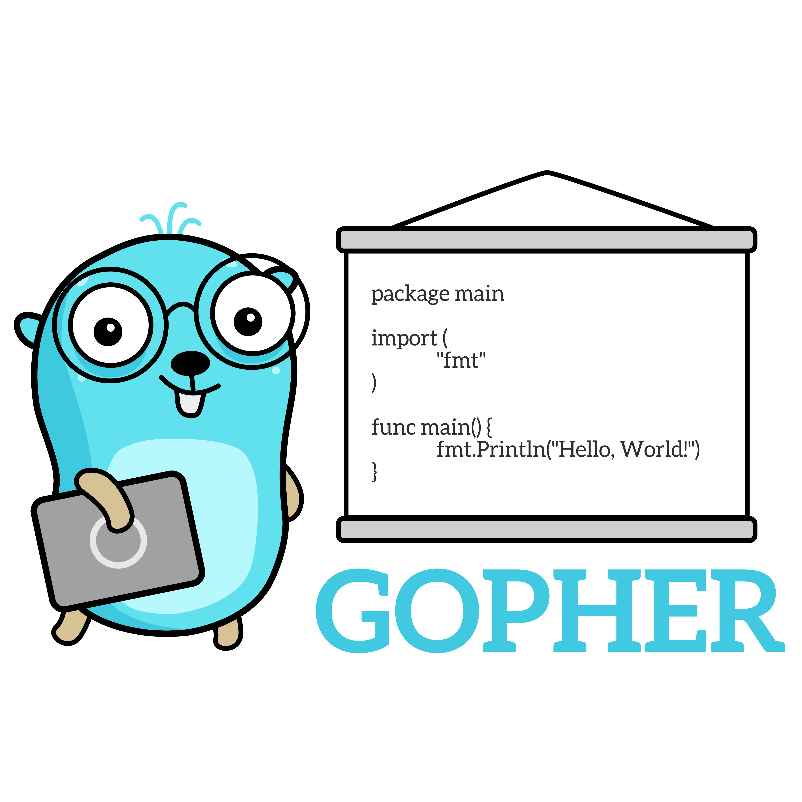

# Ultimate Go

> [If you're interested in weekly coding interview problems with detailed solutions newsletter →](https://www.getrevue.co/profile/hoanhan101)

  

This repo contains my notes on learning Go and computer systems. Different people have different
learning style. For me, I learn best by doing and walking through examples. Hence, I am trying to
take notes carefully and comment directly on the source code, rather than writing up Markdown
files. That way, I can understand every single line of code as I am reading and also be mindful of
the theories behind the scene.

In the mix, I also include links to other articles that I find helpful.

**References:**

- [Ultimate Go
  Programming](https://www.safaribooksonline.com/library/view/ultimate-go-programming/9780134757476/)
- [ardanlabs/gotraining/topics/courses/go
  ](https://github.com/ardanlabs/gotraining/blob/master/topics/courses/go/README.md)
- [Computer Systems: A Programmer's
  Perspective](https://www.amazon.com/Computer-Systems-Programmers-Perspective-3rd/dp/013409266X)
- [Free Gophers Pack](https://github.com/MariaLetta/free-gophers-pack)

## Project Status

It is a work in progress.

Below are the outline of the all topics. Normally, a topic is covered when there is a link, 
or several links next to it.

**Tasks**

- [x] Phase 1: Finish Ultimate Go Programming's video lectures
- [x] Phase 2: Fill in all the missing details using Ardan Labs's links and examples
- [ ] Phase 3: Study Computer Systems book to reinforce the theory. Build more programs if needed.

## Table of Contents 

- **Design Philosophy**:
  [Guideline](https://github.com/ardanlabs/gotraining/blob/master/topics/go/README.md)
- **Language Mechanics**
  - **Syntax**
    - Variable: [Built-in types | Zero value concept | Initialization | Conversion vs Casting
      ](go/language/variable.go)
    - Struct: [Initialization | Name type vs Anonymous type](go/language/struct.go)
    - Pointer: 
      - [Passing by value | Escape analysis | Stack space | Garbage Collection
        ](go/language/pointer.go)
      - [Golang's Code Review Receiver
        Type](https://github.com/golang/go/wiki/CodeReviewComments#receiver-type)
    - Constant: [Initialization | iota](go/language/constant.go)
    - Function: [Initialization](go/language/function.go)
  - **Data Structures**
    - Array: [CPU Cache | TLB | Initialization | Iteration | Type array | Contiguous memory
      allocation](go/language/array.go)
    - Slice: [Initialization | Length vs Capacity | Reference Type | Appending | Slice of Slice |
      Copy of Slice | UTF-8](go/language/slice.go)
    - Map: [Initialization | Iteration | Deleting | Finding | Restriction ](go/language/map.go)
  - **Decoupling**
    - Method: 
      - [Value and Pointer Receiver Call](go/language/method_1.go)
      - [Value and Pointer Semantics](go/language/method_2.go)
      - [Methods are just functions | Function variable](go/language/method_3.go)
    - Interface: 
      - [Valueless type | Concrete type vs Interface type | Relationship | Polymorphic function](go/language/interface_1.go)
      - [Interface via Pointer Receiver | Method set | Slice of Interface](go/language/interface_2.go)
    - Embedding: 
      - [Declaring fields, NOT Embedding](go/language/embedding_1.go)
      - [Embedding type | Inner type promotion](go/language/embedding_2.go)
      - [Embedded type and Interface](go/language/embedding_3.go)
      - [Outer and inner type implementing the same Interface](go/language/embedding_4.go)
    - Exporting:
      - [Guideline](go/language/exporting/README.md)
      - [Exported identifier](go/language/exporting/exporting_1)
      - [Accessing a value of an unexported identifier](go/language/exporting/exporting_2)
      - [Unexported fields from an exported struct](go/language/exporting/exporting_3)
      - [Exported types with embedded unexported types](go/language/exporting/exporting_4)
- **Software Design**
  - Composition:
    [Guideline](https://github.com/ardanlabs/gotraining/tree/master/topics/go#interface-and-composition-design)
    - Grouping types: 
      - [Grouping By State](go/design/grouping_types_1.go)
      - [Grouping By Behavior](go/design/grouping_types_2.go)
    - Decoupling: 
      - [Struct Composition](go/design/decoupling_1.go)
      - [Decoupling With Interface](go/design/decoupling_2.go)
      - [Interface Composition](go/design/decoupling_3.go)
      - [Decoupling With Interface Composition](go/design/decoupling_4.go)
    - Conversion: 
      - [Interface Conversions | Type Assertion](go/design/conversion_1.go)
      - [Runtime Type Assertion](go/design/conversion_2.go)
    - Interface Pollution: 
      - [Interface Pollution](go/design/pollution_1.go)
      - [Remove Interface Pollution](go/design/pollution_2.go)
    - Mocking: 
      - [Package To Mock](go/design/mocking_1.go)
      - [Sample Client](go/design/mocking_2.go)
  - Error Handling: 
    - [Default error values](go/design/error_1.go)
    - [Error variables](go/design/error_2.go)
    - [Type as context](go/design/error_3.go)
    - [Behavior as context](go/design/error_4.go)
    - [Finding the bug](go/design/error_5.go)
    - [Wrapping Errors](go/design/error_6.go)
  - Packaging:
    [Guideline](https://github.com/ardanlabs/gotraining/blob/master/topics/go/design/packaging/README.md)
- **Concurrency**
  - **Mechanics**
    - Goroutine: 
      - [Go Scheduler Internals](go/concurrency/goroutine_1.go)
      - [Language Mechanics](go/concurrency/goroutine_2.go)
      - [Goroutine time slicing](go/concurrency/goroutine_3.go)
      - [Goroutines and parallelism](go/concurrency/goroutine_4.go)
    - Data race: 
      - [Race Detection](go/concurrency/data_race_1.go)
      - [Atomic Functions](go/concurrency/data_race_2.go)
      - [Mutexes](go/concurrency/data_race_3.go)
      - [Read/Write Mutex](go/concurrency/data_race_4.go)
    - Channel: 
      - [Guideline](https://github.com/ardanlabs/gotraining/tree/master/topics/go#concurrent-software-design)
      - [Language Mechanics | Unbuffered channel: Signaling with(out) data](go/concurrency/channel_1.go)
      - [Unbuffered channel: Double signal | Buffered channel: Close and range | Unbuffered
        channel: select and receive | Unbuffered channel: select and send | Buffered channel:
        Select and drop](go/concurrency/channel_2.go)
      - [Unbuffered channel (Tennis match)](go/concurrency/channel_3.go)
      - [Unbuffered channel (Replay race)](go/concurrency/channel_4.go)
      - [Buffered channel: Fan Out](go/concurrency/channel_5.go)
      - [Select](go/concurrency/channel_6.go)
  - **Patterns**
    - Context: 
      - [Store and retrieve values from a context](go/concurrency/context_1.go)
      - [WithCancel](go/concurrency/context_2.go)
      - [WithDeadline](go/concurrency/context_3.go)
      - [WithTimeout](go/concurrency/context_4.go)
      - [Request/Response](go/concurrency/context_5.go)
    - Pattern
      - Task
      - Logger
- **Testing and Profiling**
  - Testing: 
    - [Basic Unit Test](go/testing/basic_test.go)
    - [Table Test](go/testing/table_test.go)
    - [Sub Test](go/testing/sub_test.go)
    - [Web Server](go/testing/web_server)
    - [Mock Server](go/testing/web_test.go)
    - [Test Coverage](go/testing/README.md)
  - Benchmarking
    - [Basic Benchmark](go/benchmark/basic_test.go)
    - [Sub Benchmark](go/benchmark/sub_test.go)
  - Fuzzing
    - [Guideline](https://github.com/ardanlabs/gotraining/blob/master/topics/go/testing/fuzzing/README.md)
  - Profiling
    - Stack Trace: [Review](go/profiling/stack_trace_1.go) | [Packing](go/profiling/stack_trace_2.go)
    - GODEBUG: [Memory Tracing](go/profiling/memory_tracing.go)
- **Packages**
  - Context
  - Encoding
  - IO
  - Logging
  - Reflection

## Stargazers over time

